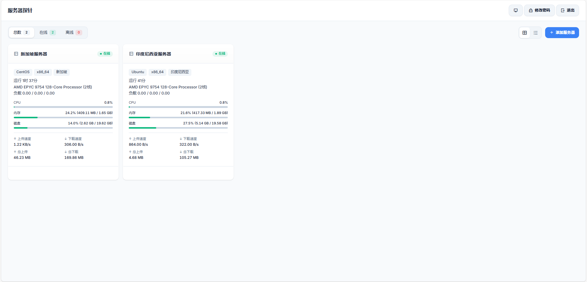
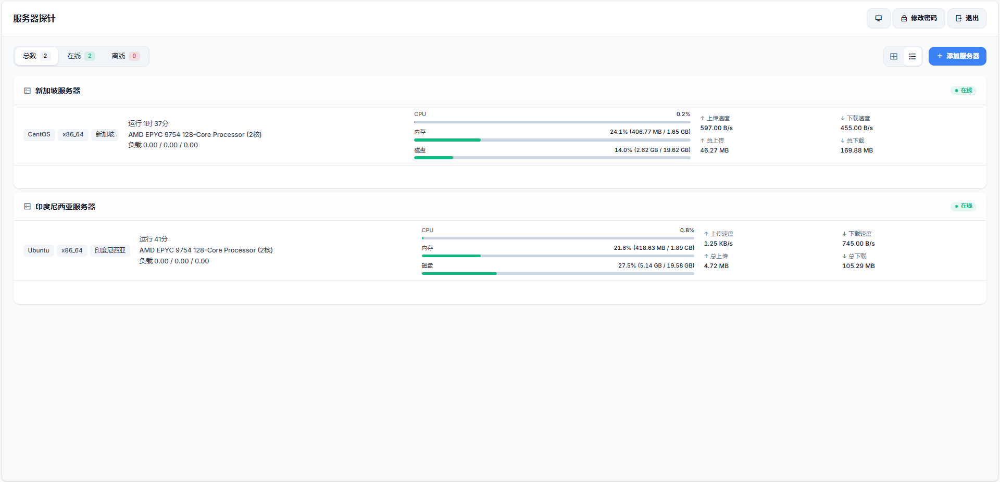

# ServerProbe 服务器探针监控系统

一个轻量、可自托管的服务器监控项目，采用 **Go 探针 + Node.js Web 控制台** 架构，支持多节点集中监控、实时指标展示、登录鉴权与基础安全防护。

## 功能特性

- 多节点管理：可添加/删除多个探针节点，统一查看状态。
- 实时监控：默认每 2 秒刷新一次核心指标。
- 核心指标覆盖：CPU、内存、磁盘、网络速度、总流量、系统信息、在线状态。
- 轻量部署：探针端单二进制可执行文件，适合 Linux/Windows。
- 安全能力：JWT 登录鉴权、登录限流、安全响应头、只读接口保护。
- 零数据库依赖：Web 端使用本地 JSON 文件持久化。

## 技术架构

- 探针端（`server`）
  - Go + gopsutil 周期采集系统指标
  - 提供只读 API：`GET /api/metrics`
- 控制台（`web`）
  - Node.js + Express 提供登录、节点管理和指标代理
  - 前端原生 HTML/CSS/JS 展示监控面板

工作流：

1. 探针部署在被监控服务器，定时采集本机指标。
2. 控制台保存节点地址，通过后端代理拉取指标。
3. 前端统一展示在线状态和性能数据。

## 目录结构

```text
ServerProbe/
├─ server/                     # Go 探针服务
│  ├─ main.go                  # 探针入口
│  ├─ internal/collector/      # 指标采集逻辑
│  ├─ internal/server/         # HTTP API
└─ web/                        # Web 控制台
   ├─ server.js                # Web 服务入口
   ├─ src/                     # 登录、鉴权、存储、路由
   ├─ public/                  # 前端静态资源
   ├─ data/                    # 本地数据文件（运行时生成）
   ├─ 1.png
   └─ 2.png
```

## 界面截图

> 仓库内示例截图如下：





## 环境要求

- Go `>= 1.26`（以 `server/go.mod` 声明为准）
- Node.js `>= 18`（以 `web/package.json` 声明为准）
- npm（随 Node.js 安装）

## 快速开始

### 1) 启动探针端（部署到每台被监控服务器）

在 `server` 目录执行：

```bash
go mod download
go run main.go -addr :9527
```

启动后默认监听 `:9527`，接口地址示例：

```text
http://<服务器IP>:9527/api/metrics
```

### 2) 启动 Web 控制台

在 `web` 目录执行：

```bash
npm install
npm start
```

默认访问地址：

```text
http://localhost:3000
```

首次默认账号：

- 用户名：`admin`
- 密码：`probe123`

### 3) 添加监控节点

登录后点击「添加服务器」，填写：

- 服务器名称（自定义）
- API 地址（如 `http://<服务器IP>:9527/api/metrics`）

添加成功后即可在面板看到实时数据。

## 配置与运行说明

### 探针端（Go）

- 启动参数：`-addr`（监听地址）
- 默认：`:9527`
- 示例：

```bash
go run main.go -addr 0.0.0.0:9527
```

### 控制台（Node.js）

- 环境变量：`PORT`
- 默认：`3000`
- 示例：

```bash
PORT=8080 npm start
```

> Windows PowerShell 示例：`$env:PORT=8080; npm start`

## API 简述

探针接口：

- `GET /api/metrics`

返回字段包括（部分）：

- 系统信息：`system`、`uptime`、`arch`、`region`
- 性能指标：`cpuUsage`、`memUsage`、`diskUsage`
- 网络指标：`uploadSpeed`、`downloadSpeed`、`totalUpload`、`totalDownload`

## 编译与部署

### 探针编译（Windows）

```powershell
go build -o monitoring.exe main.go
```

### 探针交叉编译（Linux）

```powershell
$env:GOOS = "linux"
$env:GOARCH = "amd64"
go build -o monitoring main.go
```


## 安全建议

- 首次登录后立即修改默认密码。
- 为 Web 控制台配置 HTTPS（建议 Nginx/Caddy 反向代理）。
- 探针接口为只读无鉴权，建议用防火墙限制来源 IP（仅允许控制台服务器访问）。
- 不要将运行时数据文件提交到公开仓库（如 `web/data/data.json`）。

## 常见问题

- 节点显示离线：检查目标服务器端口是否开放、API 地址是否可达。
- 无法登录：确认用户名密码是否正确，或删除 `web/data/data.json` 后重新初始化（会重置账号数据）。
- 指标异常：确认探针进程正常运行，并检查服务器负载是否过高。